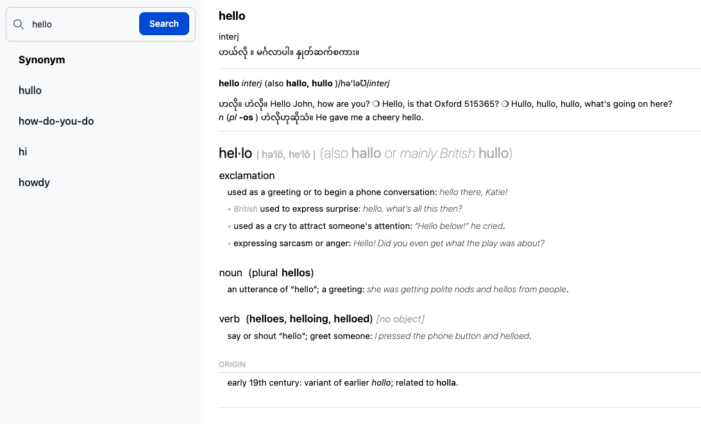
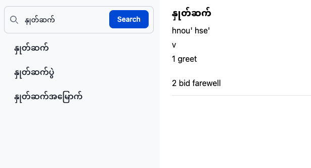

# Ornagai

Rewrite dictionary app for learning purpose. 

It's using

- Laravel
- Elastic Search for Dictionary Word Index
- Mongodb
- Tailwind
- Flowbite

For the Unit Testing

- PHPUnit

## Screenshot

